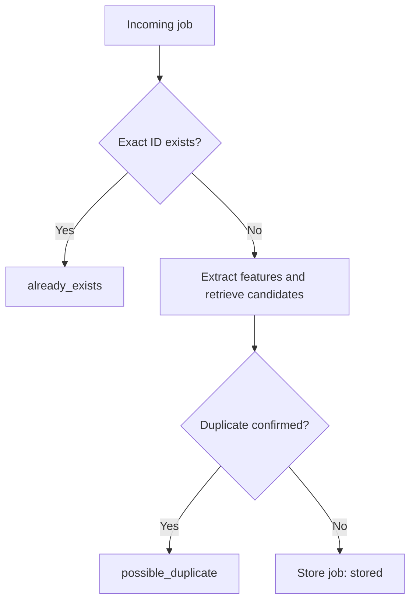

# Job Dedup RAG

A duplicate-detection pipeline for job postings collected from different
sources. It uses LangGraph to orchestrate structured LLM extraction, semantic
retrieval, and candidate comparison so that cross-posted or lightly rewritten
versions of the same opening can be identified.

## Workflow



The workflow:

1. Checks Pinecone for the incoming exact job ID.
2. Returns `already_exists` immediately when that ID is present.
3. Extracts normalized identifying features from new jobs.
4. Builds searchable text and retrieves the five closest semantic candidates.
5. Compares candidates serially in descending similarity order.
6. Returns `possible_duplicate` when a candidate represents the same opening.
7. Stores the incoming job and returns `stored` when no duplicate is confirmed.

The exact-ID path bypasses extraction, embedding, retrieval, and comparison.
Semantic retrieval returning the incoming exact ID is treated as a workflow
invariant failure.

## Structured retrieval and comparison

Feature extraction produces typed fields for:

- Company and role title
- Employer requisition ID
- Location and workplace type
- Employment type
- Seniority
- Team or business domain
- Responsibilities
- Required and preferred qualifications
- Technologies and technical practices

These fields become normalized search text before embedding. The original job
description and source information remain in Pinecone metadata so the
comparison model can evaluate complete descriptions rather than only the
compact retrieval representation.

Vector similarity identifies candidates; it does not make the final duplicate
decision. Similar roles at different companies are not duplicates unless the
descriptions contain explicit evidence that the names represent the same
employer, such as a parent/subsidiary relationship, company rename, staffing
relationship, or matching employer requisition identifier.

## Result statuses

- `already_exists`: the exact source/job ID is already stored.
- `possible_duplicate`: a different ID appears to represent the same opening;
  the incoming job is not stored.
- `stored`: no duplicate was confirmed and the incoming job was stored.

## Reliability

External Pinecone and OpenAI operations use bounded retries with exponential
backoff and jitter. Each operation receives at most three total attempts.
OpenAI client retries are disabled so that client and workflow retry policies
do not stack.

External failures are wrapped with operation and job-ID context. Internal
validation, type, and invariant failures are not retried.

Extraction and comparison models are configured independently through
environment variables.

Stored documents receive:

- `indexed_at_epoch`
- `expires_at_epoch`

The expiration is currently set to 90 days. These fields are retention
metadata only; Pinecone does not automatically delete expired records. A
cleanup process has not yet been implemented.

## Technology

- Python 3.12+
- LangGraph and LangChain
- OpenAI schema-constrained models for extraction and comparison
- `text-embedding-3-small` with 1,536-dimensional vectors
- Pinecone serverless cosine-similarity index
- Pydantic models for workflow and evaluation data

The Pinecone index must already exist with 1,536 dimensions and cosine as its
distance metric.

## Setup

Install the locked dependencies:

```bash
uv sync
```

Copy the environment template:

```bash
cp .env.example .env
```

Then configure:

```dotenv
OPENAI_API_KEY=
OPENAI_EXTRACTION_MODEL=gpt-5.4-mini
OPENAI_COMPARISON_MODEL=gpt-5.4-mini
OPENAI_EMBEDDING_MODEL=text-embedding-3-small

PINECONE_API_KEY=
PINECONE_INDEX_NAME=job-dedup-rag
PINECONE_NAMESPACE=structured-v1

# Optional LangSmith tracing
LANGSMITH_TRACING=false
LANGSMITH_ENDPOINT=https://api.smith.langchain.com
LANGSMITH_API_KEY=
LANGSMITH_PROJECT=job-dedup-rag-development
```

`.env` and `data/jobs/` are intentionally ignored by Git. The private data
directory contains real job descriptions and must remain local.

## Production/private ingestion

Place `manifest.json` and its referenced description files under `data/jobs/`.

```bash
uv run python main.py
```

This command processes the private manifest and can make paid API calls and
write records to the configured Pinecone namespace. Do not use it as a casual
development check.

## Evaluation architecture

Evaluation uses the same compiled LangGraph workflow as production, but injects
a no-write storage node. This preserves the graph topology while preventing
evaluation query jobs from being stored when their predicted result is
`stored`.

The evaluation reports:

- Status accuracy
- Duplicate precision and recall
- False-positive and false-negative case IDs
- Retrieval recall at five
- Mean matching-candidate rank
- Mean comparison count
- Matched-job-ID accuracy
- Total latency
- Token and estimated-cost totals when collected

Uncollected token and cost measurements are reported as `null`, not zero.

### Public synthetic evaluation

Tracked synthetic data lives under `evaluation_data/`:

- `seeds/` contains the stored reference jobs.
- `cases/` contains evaluation queries.
- `seed_manifest.json` defines the reference corpus.
- `evaluation_manifest.json` defines expected outcomes.

Evaluation namespaces must begin with `evaluation-` and include a suffix.

Seed the reference corpus:

```bash
PINECONE_NAMESPACE=evaluation-m4-20260816 \
uv run python -m evals.seed_evaluation
```

The seed command intentionally writes three fixed-ID vectors. Repeated runs
upsert those same IDs.

Run the no-write synthetic evaluation:

```bash
PINECONE_NAMESPACE=evaluation-m4-20260816 \
uv run python -m evals.synthetic_evaluation
```

### Private evaluation

Private evaluation data remains under the ignored `data/jobs/` directory. It
can test exact-ID and cross-source behavior against the private
`structured-v1` corpus:

```bash
uv run python -m evals.private_evaluation
```

The private evaluation runner also injects the no-write storage node.

## Current measured baseline

The Milestone 4 synthetic corpus contains five cases:

| Case | Expected result | Observed result |
| --- | --- | --- |
| Exact-ID platform manager | `already_exists` | `already_exists` |
| Cross-source platform repost | `possible_duplicate` | `possible_duplicate` |
| Same company, different team | `stored` | `stored` |
| Different company, similar role | `stored` | `stored` |
| Same team, different seniority | `stored` | `stored` |

Latest synthetic results:

- Status accuracy: `1.0`
- Duplicate precision: `1.0`
- Duplicate recall: `1.0`
- Retrieval recall at five: `1.0`
- Mean matching-candidate rank: `1.0`
- Matched-job-ID accuracy: `1.0`
- Mean comparison count: `2.0`
- False positives: none
- False negatives: none
- Total measured latency: approximately `36.56` seconds
- Token usage and estimated cost: not currently collected

This is a small synthetic baseline, not evidence of production-level accuracy.

## Project structure

```text
job_dedup_rag/    core domain package: graph, nodes, models, state, vector
                  store, retry policy, exceptions, reusable evaluation models
                  and metrics (evaluation.py), and the manifest loader used by
                  production ingestion (file_loader.py)
evals/            evaluation/seeding command entry points (seed_evaluation,
                  synthetic_evaluation, private_evaluation, evaluation_runner)
                  plus the evaluation-manifest loader they use
tests/unit/       pytest, no network or credentials required, runs by default
tests/live/       pytest, marked `live` — real OpenAI/Pinecone calls, opt-in;
                  a subset additionally requires the private, gitignored
                  data/jobs/ corpus and is skipped automatically without it;
                  a further subset is also marked `mutating` (intentionally
                  writes to and deletes from Pinecone) and refuses to run
                  outside a guarded evaluation-* namespace
evaluation_data/  public synthetic fixtures (seeds/, cases/, manifests)
main.py           production ingestion entry point (private data, paid calls)
```

## Development checks

`tests/` is a `pytest` suite, split into local and live tiers. Run the local
suite (no credentials, no network, safe by default):

```bash
uv run pytest
```

Live tests are marked `live` and excluded by default via `pyproject.toml`'s
`addopts`. They make real OpenAI/Pinecone calls and may incur cost; a subset
additionally requires the private `data/jobs/` corpus and self-skips when it's
absent. Live tests are further split by whether they intentionally write:

Live tests with no intentional writes (still real, paid API calls; the two
tests that build the full graph inject a no-write storage node as a safety
net so a failed assertion can't fall through to a real store):

```bash
uv run pytest tests/live -m "live and not mutating"
```

Explicitly mutating tests — write and delete a uniquely-ID'd record — using a
guarded evaluation namespace. These refuse to run against `structured-v1`,
the default/empty namespace, or any namespace that isn't prefixed
`evaluation-`:

```bash
PINECONE_NAMESPACE=evaluation-live-tests \
uv run pytest tests/live -m "live and mutating"
```

The focused different-company comparison regression check (public data only,
no writes) is:

```bash
uv run pytest tests/live/test_different_company_comparison.py -m live
```

Standard static validation:

```bash
uv run ruff check --fix .
uv run ruff format .
uv run ruff check .
uv run python -m compileall job_dedup_rag evals tests main.py
git diff --check
```

## Tracing and privacy

LangSmith tracing is optional and disabled by default. When enabled, traces may
contain complete job descriptions, prompts, candidate documents, extracted
features, model outputs, and graph state.

Enable tracing only in an approved environment and follow applicable privacy,
access-control, and retention requirements. Do not include private job data,
credentials, `.env`, or `data/jobs/` in public archives or commits.

## Current limitations

- The synthetic evaluation corpus is intentionally small.
- Token usage and estimated cost are not yet collected from model calls.
- Retention metadata is not enforced by a cleanup process.
- Older private vectors have not been backfilled with retention metadata.
- Company aliases and corporate relationships still require comparison-model
  judgment.
- JobTracker integration is not implemented.
